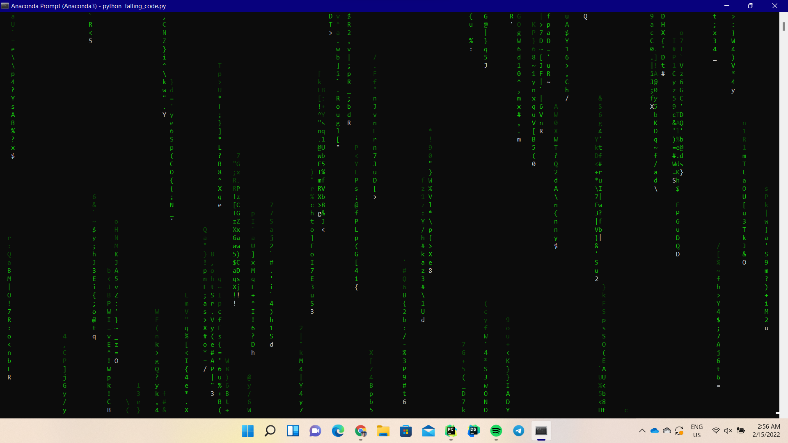

# MatrixFallingCode

Matrix falling code in terminal. written in Vanilla Python with no need to install any dependency.

when ran in the terminal, the script has two optional parameters:

1.  `-he HEIGHT, --height HEIGHT`
                        number of character of falling strings
2.  `-s SPEED, --speed SPEED`
                        time no print a new line in seconds
                        
the falling code adjusts automatically to the width of the window.

